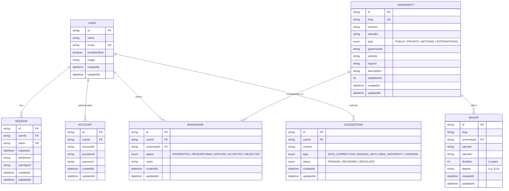
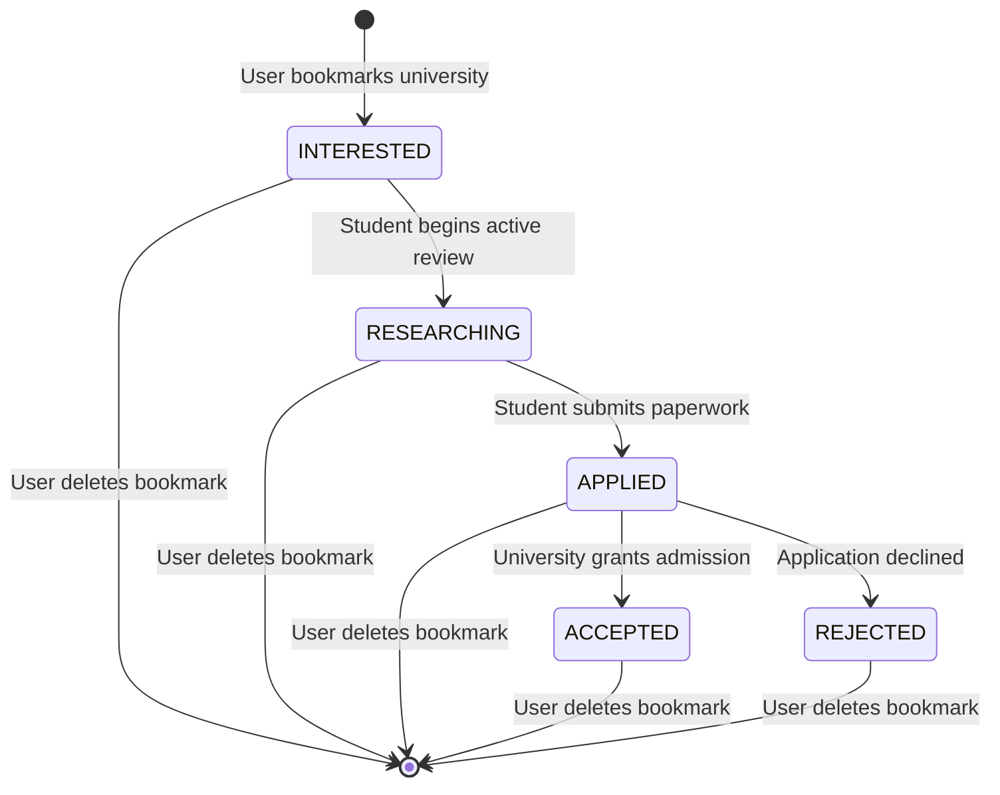

# Data Model Specification: UniCompass Core Platform

**Feature**: UniCompass Core University Guide Platform (`001-unicompass-core-platform`)  
**Date**: 2026-08-15  

---

## 1. Entity Relationship Diagram

---

## 2. Entities & Field Definitions

### 2.1 University (`universities`)
- **`id`** (`String`, `@id`, `@default(cuid())`): Unique identifier.
- **`slug`** (`String`, `@unique`): URL-friendly unique identifier (e.g., `cairo-university`, `guc`, `nu`).
- **`nameAr`** (`String`, min 1, max 200): Official Arabic name (e.g., "جامعة القاهرة").
- **`nameEn`** (`String`, min 1, max 200): Official English name (e.g., "Cairo University").
- **`type`** (`UniversityType`): Classification enum:
  - `PUBLIC` (حكومية)
  - `PRIVATE` (خاصة)
  - `NATIONAL` (أهلية)
  - `INTERNATIONAL` (دولية / أفرع جامعات أجنبية)
- **`governorate`** (`String`): Egyptian Governorate (e.g., `Cairo`, `Giza`, `Alexandria`, `Qalyubia`, `Assiut`, etc.).
- **`website`** (`String?`, URL format): Official university portal URL.
- **`logoUrl`** (`String?`, URL format): High-resolution official logo image URL.
- **`description`** (`String?`, max 2000 chars): Overview of campus, accreditations, and history.
- **`established`** (`Int?`, 1800-2100): Year founded.
- **Indexes**: `@@index([type])`, `@@index([governorate])`

---

### 2.2 Major / Academic Program (`majors`)
- **`id`** (`String`, `@id`, `@default(cuid())`): Unique identifier.
- **`slug`** (`String`): Program identifier within university (e.g., `computer-science`, `dentistry`).
- **`universityId`** (`String`, foreign key → `universities.id`, `onDelete: Cascade`): University offering the major.
- **`nameAr`** (`String`): Program title in Arabic (e.g., "هندسة الحاسبات والذكاء الاصطناعي").
- **`nameEn`** (`String`): Program title in English (e.g., "Computer Engineering & AI").
- **`duration`** (`Int`, min 1, max 10): Program duration in academic years.
- **`degree`** (`String`): Conferred degree title (e.g., "B.Sc.", "B.A.", "Pharm.D.", "B.Eng.").
- **Constraints**: `@@unique([slug, universityId])`

---

### 2.3 User & Authentication Entities (`users`, `sessions`, `accounts`, `verifications`)
- **`User`**: Core user record.
  - `id`: CUID
  - `name`: User display name (min 2, max 100)
  - `email`: User unique email address (validated format)
  - `emailVerified`: Boolean verification flag
  - `image`: Avatar URL
- **`Session`**: Active browser session tracking.
  - `userId`, `token` (unique), `expiresAt`, `ipAddress`, `userAgent`
- **`Account`**: Provider credential backing.
  - `userId`, `accountId`, `providerId` (credential/google), `password` (argon2/bcrypt hash)
- **`Verification`**: One-time verification tokens for email confirmation/password resets.

---

### 2.4 Tracked Application / Bookmark (`bookmarks`)
- **`id`** (`String`, `@id`, `@default(cuid())`): Unique identifier.
- **`userId`** (`String`, foreign key → `users.id`, `onDelete: Cascade`): Student account owner.
- **`universityId`** (`String`, foreign key → `universities.id`, `onDelete: Cascade`): Saved institution.
- **`status`** (`AppStatus`, `@default(INTERESTED)`):
  - `INTERESTED`: Saved to explore later
  - `RESEARCHING`: Checking tuition, admission tests, and majors
  - `APPLIED`: Application documents submitted
  - `ACCEPTED`: Acceptance letter received
  - `REJECTED`: Application rejected or unselected
- **`notes`** (`String?`, max 500 chars): Private student notes (deadlines, requirements).
- **Constraints**: `@@unique([userId, universityId])` (one card per university per student).

---

### 2.5 Community Feedback & Data Suggestion (`suggestions`)
- **`id`** (`String`, `@id`, `@default(cuid())`): Unique identifier.
- **`userId`** (`String`, foreign key → `users.id`, `onDelete: Cascade`): Submitter.
- **`content`** (`String`, min 5, max 2000 chars): Detailed correction notes.
- **`type`** (`SuggestionType`): `DATA_CORRECTION`, `MISSING_INFO`, `NEW_UNIVERSITY`, `GENERAL`
- **`status`** (`SuggestionStatus`, `@default(PENDING)`): `PENDING`, `REVIEWED`, `RESOLVED`

---

## 3. Application State Transitions

