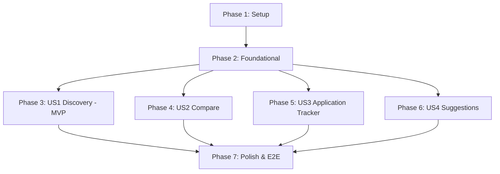

# Tasks: UniCompass Core University Guide Platform

**Input**: Design documents from `specs/001-unicompass-core-platform/`  
**Prerequisites**: [plan.md](./plan.md) (required), [spec.md](./spec.md) (required), [research.md](./research.md), [data-model.md](./data-model.md), [contracts/](./contracts/), [quickstart.md](./quickstart.md)  
**Tests**: Unit tests for domain services (Vitest) and End-to-End integration tests (Playwright) included.  
**Organization**: Tasks are grouped by user story to enable independent implementation and testing of each story.

## Format: `[ID] [P?] [Story] Description`

- **[P]**: Can run in parallel (different files, no dependencies)
- **[Story]**: Which user story this task belongs to (`US1`, `US2`, `US3`, `US4`)
- All task descriptions include exact file paths.

---

## Phase 1: Setup (Shared Infrastructure)

**Purpose**: Project initialization, dependency management, and core configurations.

- [ ] T001 Initialize Next.js 15 App Router project structure with TypeScript, Tailwind CSS, and ESLint in `src/`
- [ ] T002 [P] Install core runtime and dev dependencies (`prisma`, `@prisma/client`, `@prisma/adapter-pg`, `@prisma/extension-accelerate`, `pg`, `better-auth`, `zod`, `@t3-oss/env-nextjs`, `zustand`, `@tanstack/react-query`, `react-hook-form`, `@hookform/resolvers`, `vitest`, `@types/pg`) in `package.json`
- [ ] T003 [P] Configure build-time environment validation schema in `src/env.ts` and environment template in `.env.example`
- [ ] T004 [P] Configure Vitest test runner configuration in `vitest.config.ts`
- [ ] T005 [P] Configure global Tailwind CSS theme tokens and root layout fonts in `src/app/globals.css` and `src/app/layout.tsx`

---

## Phase 2: Foundational (Blocking Prerequisites)

**Purpose**: Core data layer, authentication framework, and shared UI primitives that MUST be complete before user stories can proceed.

**⚠️ CRITICAL**: No user story work can begin until this phase is complete.

- [ ] T006 Define Prisma schema with User, Session, Account, Verification, University, Major, Bookmark, and Suggestion models in `prisma/schema.prisma`
- [ ] T007 Implement unified database client with Neon PostgreSQL primary adapter and Prisma Accelerate lazy failover in `src/lib/prisma.ts`
- [ ] T008 [P] Configure BetterAuth server instance with Prisma adapter and session rules in `src/lib/auth.ts`
- [ ] T009 [P] Configure BetterAuth browser React client instance in `src/lib/auth-client.ts`
- [ ] T010 [P] Implement BetterAuth API catch-all route handler in `src/app/api/auth/[...all]/route.ts`
- [ ] T011 [P] Configure BetterAuth protected route guard middleware in `src/middleware.ts`
- [ ] T012 [P] Implement TanStack Query client and provider wrapper in `src/lib/query-client.ts` and `src/components/providers/QueryProvider.tsx`
- [ ] T013 [P] Install and configure core shadcn/ui primitives (Button, Card, Input, Badge, Dialog, Select, DropdownMenu) in `src/components/ui/`
- [ ] T014 Implement global navigation header and footer layout components in `src/components/layout/Navbar.tsx` and `src/components/layout/Footer.tsx`

**Checkpoint**: Foundation ready — user story implementation can now begin.

---

## Phase 3: User Story 1 - Bilingual University & Major Discovery (Priority: P1) 🎯 MVP

**Goal**: Visitors can explore, search in Arabic/English, filter by governorate/type, and view detailed university profile pages with offered academic majors.

**Independent Test**: Navigate to `/universities`, apply filters for institution type (`National`) and governorate (`Giza`), execute search in Arabic (`جامعة القاهرة`), open university detail page `/universities/[slug]`, and verify full list of faculties and majors.

### Tests for User Story 1

- [ ] T015 [P] [US1] Create unit tests for `UniversityService` with mock repository in `tests/unit/UniversityService.test.ts`

### Implementation for User Story 1

- [ ] T016 [P] [US1] Define University and Major Zod validation schemas and filter types in `src/schemas/university.schema.ts`
- [ ] T017 [P] [US1] Define `IUniversityRepository` interface in `src/server/repositories/interfaces/IUniversityRepository.ts`
- [ ] T018 [US1] Implement `UniversityRepository` with bilingual search, governorate & type filtering, and pagination in `src/server/repositories/UniversityRepository.ts`
- [ ] T019 [US1] Implement `UniversityService` business logic with schema validation and slug lookups in `src/server/services/UniversityService.ts`
- [ ] T020 [US1] Implement type-safe `getUniversitiesAction` and `getUniversityBySlugAction` Server Actions in `src/server/actions/university.actions.ts`
- [ ] T021 [P] [US1] Create `UniversityCard` component displaying bilingual names, tags, logo, and metadata in `src/components/university/UniversityCard.tsx`
- [ ] T022 [P] [US1] Create `UniversityFilters` and `UniversitySearch` components for governorates and types in `src/components/university/UniversityFilters.tsx` and `src/components/university/UniversitySearch.tsx`
- [ ] T023 [US1] Implement public university catalog listing page with ISR caching (1-hour revalidation) in `src/app/universities/page.tsx`
- [ ] T024 [US1] Implement dynamic university profile page with `generateStaticParams`, overview, and academic majors list in `src/app/universities/[slug]/page.tsx`
- [ ] T025 [P] [US1] Create `MajorList` and major faculty grouping components in `src/components/university/MajorList.tsx`
- [ ] T026 [US1] Implement public marketing homepage with featured universities and search hero in `src/app/(marketing)/page.tsx`
- [ ] T027 [US1] Implement comprehensive database seed script populating Egyptian universities and majors in `prisma/seed.ts`

**Checkpoint**: User Story 1 is fully functional and independently testable as the core MVP.

---

## Phase 4: User Story 2 - Side-by-Side Multi-University Comparison (Priority: P2)

**Goal**: Students can select up to 3 universities to compare side-by-side across locations, degrees, and academic majors with persisted selection.

**Independent Test**: Select 2 or 3 universities from directory cards or profiles, open comparison drawer, verify aligned dimensions, test FIFO replacement upon selecting a 4th university, and verify selections persist across page refreshes.

### Implementation for User Story 2

- [ ] T028 [P] [US2] Implement persisted Zustand comparison store (up to 3 items, FIFO queue, localStorage sync) in `src/stores/compareStore.ts`
- [ ] T029 [P] [US2] Create `CompareToggleButton` component for university cards and profiles in `src/components/university/CompareToggleButton.tsx`
- [ ] T030 [US2] Implement sticky floating `CompareDrawer` preview tray in `src/components/university/CompareDrawer.tsx`
- [ ] T031 [US2] Implement dedicated side-by-side multi-university comparison matrix view in `src/components/university/CompareMatrix.tsx` and `src/app/compare/page.tsx`

**Checkpoint**: User Stories 1 AND 2 are functional and work seamlessly together.

---

## Phase 5: User Story 3 - Personalized Student Application Tracker & Kanban Dashboard (Priority: P3)

**Goal**: Registered students can bookmark universities and organize their admissions journey across Kanban stages (`Interested`, `Researching`, `Applied`, `Accepted`, `Rejected`) with private notes.

**Independent Test**: Sign up/in with credentials, bookmark a university from a card/detail page, navigate to `/dashboard`, move the card between stages, update student private notes, and confirm persistence after reload.

### Tests for User Story 3

- [ ] T032 [P] [US3] Create unit tests for `BookmarkService` with mock repository in `tests/unit/BookmarkService.test.ts`

### Implementation for User Story 3

- [ ] T033 [P] [US3] Define Bookmark Zod validation schemas and `AppStatus` enum in `src/schemas/bookmark.schema.ts`
- [ ] T034 [P] [US3] Define `IBookmarkRepository` interface in `src/server/repositories/interfaces/IBookmarkRepository.ts`
- [ ] T035 [US3] Implement `BookmarkRepository` with owner queries and status updates in `src/server/repositories/BookmarkRepository.ts`
- [ ] T036 [US3] Implement `BookmarkService` business logic with user authorization and note updates in `src/server/services/BookmarkService.ts`
- [ ] T037 [US3] Implement `createBookmarkAction`, `updateBookmarkAction`, `deleteBookmarkAction`, and `getUserBookmarksAction` in `src/server/actions/bookmark.actions.ts`
- [ ] T038 [P] [US3] Implement authentication forms (LoginForm, RegisterForm) using React Hook Form + Zod and BetterAuth client in `src/components/forms/LoginForm.tsx` and `src/components/forms/RegisterForm.tsx`
- [ ] T039 [P] [US3] Implement custom React mutation hook for optimistic Kanban card updates in `src/hooks/useBookmarks.ts`
- [ ] T040 [US3] Implement Kanban application board and column components (`Interested`, `Researching`, `Applied`, `Accepted`, `Rejected`) in `src/components/dashboard/KanbanBoard.tsx` and `src/components/dashboard/KanbanColumn.tsx`
- [ ] T041 [P] [US3] Implement `BookmarkCard` and student private `NoteDialog` modal in `src/components/dashboard/BookmarkCard.tsx` and `src/components/dashboard/NoteDialog.tsx`
- [ ] T042 [US3] Implement protected student dashboard page and layout in `src/app/dashboard/page.tsx` and `src/app/dashboard/layout.tsx`

**Checkpoint**: User Stories 1, 2, and 3 are functional with full authentication and student tracking.

---

## Phase 6: User Story 4 - Community Feedback & Data Corrections (Priority: P4)

**Goal**: Authenticated students and community members can submit corrections for outdated data or request missing majors/universities.

**Independent Test**: Open suggestion dialog from university profile, submit a `Data Correction` or `Missing Information` entry, and verify receipt acknowledgment and database recording.

### Implementation for User Story 4

- [ ] T043 [P] [US4] Define Suggestion Zod validation schema and types in `src/schemas/suggestion.schema.ts`
- [ ] T044 [P] [US4] Define `ISuggestionRepository` interface and implementation in `src/server/repositories/interfaces/ISuggestionRepository.ts` and `src/server/repositories/SuggestionRepository.ts`
- [ ] T045 [US4] Implement `SuggestionService` and `submitSuggestionAction` Server Action in `src/server/services/SuggestionService.ts` and `src/server/actions/suggestion.actions.ts`
- [ ] T046 [US4] Implement `SuggestionDialog` feedback modal and form component in `src/components/forms/SuggestionForm.tsx` and `src/components/university/SuggestionDialog.tsx`

**Checkpoint**: All user stories (US1 through US4) are fully functional.

---

## Phase 7: Polish & Cross-Cutting Concerns

**Purpose**: Production readiness, bilingual styling optimization, automated E2E testing, and deployment verification.

- [ ] T047 [P] Implement bilingual Arabic/English font optimization and RTL/LTR direction support in `src/app/layout.tsx` and `src/app/globals.css`
- [ ] T048 [P] Implement dynamic XML sitemap and OpenGraph metadata generation in `src/app/sitemap.ts` and `src/app/robots.ts`
- [ ] T049 Implement Playwright E2E test suites for public discovery, comparison, and student dashboard in `tests/e2e/catalog-search.spec.ts` and `tests/e2e/student-dashboard.spec.ts`
- [ ] T050 Validate full production build, type check, linting, and quickstart verification per `specs/001-unicompass-core-platform/quickstart.md`

---

## Dependencies & Execution Order

### Phase Dependencies

- **Setup (Phase 1)**: Must complete first.
- **Foundational (Phase 2)**: Depends on Setup completion — BLOCKS all user stories.
- **User Stories (Phase 3–6)**: Can proceed sequentially (P1 → P2 → P3 → P4) or in parallel once Foundational is complete.
- **Polish (Phase 7)**: Executed after user stories to validate E2E and production build.

---

## Parallel Execution Opportunities

### Phase 1 (Setup)
- T002 (`package.json`), T003 (`src/env.ts`), T004 (`vitest.config.ts`), and T005 (`src/app/globals.css`) can run concurrently.

### Phase 2 (Foundational)
- T008 (`auth.ts`), T009 (`auth-client.ts`), T010 (`route.ts`), T011 (`middleware.ts`), T012 (`QueryProvider.tsx`), and T013 (`components/ui/*`) can run concurrently.

### Phase 3 (US1 Discovery)
- T015 (Tests), T016 (Schemas), T017 (Repository interface), T021 (UniversityCard), T022 (Filters/Search), and T025 (MajorList) can run concurrently.

### Phase 4 (US2 Comparison)
- T028 (Zustand store) and T029 (CompareToggleButton) can run concurrently.

### Phase 5 (US3 Dashboard)
- T032 (Tests), T033 (Schemas), T034 (Repository interface), T038 (Auth forms), T039 (Mutation hook), and T041 (BookmarkCard/NoteDialog) can run concurrently.

---

## Implementation Strategy (MVP First)

1. **Sprint 1 (MVP Foundation)**: Complete Phase 1 (Setup), Phase 2 (Foundational), and Phase 3 (US1 Discovery + Data Seeder). Validate public catalog and profile pages.
2. **Sprint 2 (Decision Tools)**: Complete Phase 4 (US2 Comparison Matrix). Test multi-university comparison drawer and matrix.
3. **Sprint 3 (Student Pipeline)**: Complete Phase 5 (US3 Auth + Kanban Dashboard). Test admissions tracker and notes.
4. **Sprint 4 (Community & Polish)**: Complete Phase 6 (US4 Suggestions) and Phase 7 (Polish, E2E tests, SEO, build verification).
