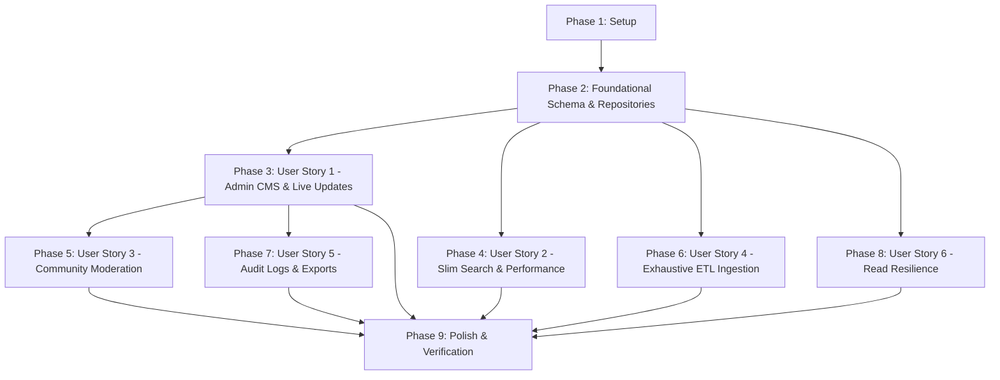

# Tasks: Production Data Architecture & Admin CMS Suite

**Feature Branch**: `002-data-cms`  
**Input**: Design documents from `specs/002-data-cms/` (`spec.md`, `plan.md`, `data-model.md`, `contracts/`, `research.md`, `quickstart.md`)  
**Status**: Ready for Implementation  

---

## Phase 1: Setup (Shared Infrastructure)

**Purpose**: Project dependency check, environment validation, and shared type definitions.

- [ ] T001 [P] Validate environment variables schema in `src/env.ts` with strict database URL checks
- [ ] T002 [P] Create domain type definitions for universities, faculties, and programs in `src/types/university.types.ts`
- [ ] T003 [P] Create audit log and governance types in `src/types/audit.types.ts`
- [ ] T004 [P] Create Zod domain validation schemas in `src/schemas/university.schema.ts`
- [ ] T005 [P] Create Zod degree program and tuition validation schemas in `src/schemas/program.schema.ts`
- [ ] T006 [P] Create Zod faculty and dean validation schemas in `src/schemas/faculty.schema.ts`
- [ ] T007 [P] Create Zod suggestion validation schemas in `src/schemas/suggestion.schema.ts`

---

## Phase 2: Foundational (Blocking Prerequisites)

**Purpose**: Normalized database schema, repository interfaces, data mappers, and core dependency injection.

**⚠️ CRITICAL**: Must be completed before any User Story tasks can proceed.

- [ ] T008 Expand Prisma schema in `prisma/schema.prisma` with `Faculty`, `DegreeProgram`, `Accreditation`, `AuditLog`, expanded `University` fields, and `UserRole` enum
- [ ] T009 Apply database migrations to PostgreSQL via `pnpm prisma db push`
- [ ] T010 [P] Define ISP-compliant repository interfaces in `src/server/repositories/interfaces/IUniversityRepository.ts` (`IUniversityReader` and `IUniversityWriter`)
- [ ] T011 [P] Define `IAuditLogRepository` interface in `src/server/repositories/interfaces/IAuditLogRepository.ts`
- [ ] T012 [P] Implement `UniversityMapper` in `src/server/mappers/UniversityMapper.ts` for DTO, AdminDTO, and SlimSearchToken transformations
- [ ] T013 [P] Implement `FacultyMapper` and `DegreeProgramMapper` in `src/server/mappers/FacultyMapper.ts` and `src/server/mappers/DegreeProgramMapper.ts`
- [ ] T014 Implement `PostgresUniversityRepository` in `src/server/repositories/PostgresUniversityRepository.ts` using Prisma Client
- [ ] T015 Implement `AuditLogRepository` in `src/server/repositories/AuditLogRepository.ts` supporting INSERT-only audit logging
- [ ] T016 Implement on-demand cache invalidator in `src/lib/cache-invalidator.ts` utilizing `revalidateTag` and `revalidatePath`
- [ ] T017 Wire Dependency Injection composition root in `src/lib/di.ts` linking repositories and services

**Checkpoint**: Core database models, interfaces, mappers, and repositories are verified.

---

## Phase 3: User Story 1 - Real-Time University & Program Data Management (Priority: P0) 🎯 MVP

**Goal**: Authorized administrators can manage universities, faculties, and degree programs with live on-demand cache revalidation.

**Independent Test**: Log into `/admin`, update annual tuition or edit a faculty dean, save changes, and verify the live public catalog reflects updates immediately (< 2.0s).

### Implementation for User Story 1
- [ ] T018 [US1] Implement `AdminUniversityService` in `src/server/services/AdminUniversityService.ts` for institution lifecycle management and audit dispatch
- [ ] T019 [US1] Implement university admin Server Actions in `src/server/actions/admin/university.admin.actions.ts` with role validation and cache invalidation
- [ ] T020 [P] [US1] Implement faculty admin Server Actions in `src/server/actions/admin/faculty.admin.actions.ts`
- [ ] T021 [P] [US1] Implement degree program admin Server Actions in `src/server/actions/admin/program.admin.actions.ts`
- [ ] T022 [US1] Create role-guarded Admin layout and navigation in `src/app/admin/layout.tsx`, `src/components/admin/AdminSidebar.tsx`, and `src/components/admin/AdminHeader.tsx`
- [ ] T023 [US1] Build Admin Dashboard overview with metrics in `src/app/admin/page.tsx`
- [ ] T024 [US1] Build paginated University table view in `src/app/admin/universities/page.tsx`
- [ ] T025 [US1] Build bilingual University create & edit form in `src/components/admin/UniversityForm.tsx` and `src/app/admin/universities/[id]/page.tsx`
- [ ] T026 [US1] Build Faculty and Dean manager view in `src/app/admin/universities/[id]/faculties/page.tsx` and `src/components/admin/FacultyModal.tsx`
- [ ] T027 [US1] Build Degree Program and Tuition manager in `src/app/admin/universities/[id]/programs/page.tsx` and `src/components/admin/ProgramModal.tsx`
- [ ] T028 [US1] Implement optimistic locking and conflict resolution UI in `src/components/admin/ConflictResolutionDialog.tsx`

**Checkpoint**: Administrators can perform full CRUD across universities, faculties, and programs with instant live updates.

---

## Phase 4: User Story 2 - Instant Search & Low-Bandwidth Profile Delivery (Priority: P0)

**Goal**: Deliver instant autocomplete search (<50ms) using a slim static JSON index (<35 KB) and load complete university profiles on demand.

**Independent Test**: Load the public catalog on throttled network; verify initial JS transfer ≤ 150 KB and search autocomplete responds in < 50ms without bundling `database.js`.

### Implementation for User Story 2
- [ ] T029 [US2] Implement `SearchIndexService` in `src/server/services/SearchIndexService.ts` to query minimal search tokens
- [ ] T030 [US2] Create CLI index generation script in `scripts/generate-search-index.ts` to output `public/search-index.json`
- [ ] T031 [US2] Add `generate-index` npm script in `package.json`
- [ ] T032 [US2] Implement on-demand university detail Route Handler in `src/app/api/universities/[slug]/route.ts` with ISR tags
- [ ] T033 [US2] Update public search hook in `src/hooks/useUniversitySearch.ts` to load `/search-index.json`
- [ ] T034 [US2] Migrate public catalog page in `src/app/universities/page.tsx` to use `PostgresUniversityRepository` with server-side pagination
- [ ] T035 [US2] Migrate public marketing homepage in `src/app/(marketing)/page.tsx` to read from server service
- [ ] T036 [US2] Update University Detail Modal in `src/components/university/UniversityModal.tsx` to fetch full relational profile on demand
- [ ] T037 [US2] Remove deprecated `src/data/database.js` references across the codebase

**Checkpoint**: Public catalog runs with sub-50ms search and ≤ 150 KB initial JS transfer.

---

## Phase 5: User Story 3 - Community Data Correction & Verification Pipeline (Priority: P1)

**Goal**: Allow students to submit structured corrections and enable administrators to review, approve, or reject suggestions in one click.

**Independent Test**: Submit a correction on a university modal, review it in `/admin/suggestions`, click "Approve & Apply", and confirm the university profile updates immediately.

### Implementation for User Story 3
- [ ] T038 [US3] Implement `SuggestionRepository` in `src/server/repositories/SuggestionRepository.ts`
- [ ] T039 [US3] Implement `SuggestionService` in `src/server/services/SuggestionService.ts` managing `PENDING → RESOLVED / REJECTED` lifecycle
- [ ] T040 [US3] Implement public suggestion submission Server Action in `src/server/actions/public/suggestion.actions.ts`
- [ ] T041 [US3] Implement admin suggestion moderation Server Action in `src/server/actions/admin/suggestion.admin.actions.ts` (Approve & Apply, Reject)
- [ ] T042 [P] [US3] Build public "Suggest Data Correction" modal dialog in `src/components/university/SuggestCorrectionModal.tsx`
- [ ] T043 [US3] Build Admin Moderation Inbox in `src/app/admin/suggestions/page.tsx` and `src/components/admin/SuggestionReviewDialog.tsx`

**Checkpoint**: Community data corrections flow seamlessly from public submission to administrative 1-click merge.

---

## Phase 6: User Story 4 - Automated Exhaustive Data Ingestion & Sync (Priority: P1)

**Goal**: Ingest 30+ universities, 150+ faculties, and 400+ degree programs from the 5.24 MB raw JSON dataset idempotently with error logging.

**Independent Test**: Execute `pnpm tsx prisma/etl/seed-deep.ts`; assert all institutions, faculties, and programs exist with zero duplicate rows and zero FK violations.

### Implementation for User Story 4
- [ ] T044 [P] [US4] Implement raw data transformation and tuition regex parser in `prisma/etl/transform.ts`
- [ ] T045 [P] [US4] Implement Zod pre-validation and error streaming to `etl-errors.jsonl` in `prisma/etl/validate.ts`
- [ ] T046 [P] [US4] Implement checkpoint state manager in `prisma/etl/checkpoint.ts` for resume capability
- [ ] T047 [US4] Build transactional master ingestion orchestrator in `prisma/etl/seed-deep.ts` using `prisma.$transaction()` per university
- [ ] T048 [US4] Add `db:seed-deep` script to `package.json` and execute full dataset injection

**Checkpoint**: PostgreSQL database is populated with all 30+ universities and 400+ degree programs.

---

## Phase 7: User Story 5 - Operational Audit Logging & Snapshot Exports (Priority: P2)

**Goal**: Maintain immutable operational history and enable full JSON snapshot exports for data backups.

**Independent Test**: Make administrative edits, inspect the audit log table in `/admin/audit-log`, and download a complete JSON snapshot from `/admin/export`.

### Implementation for User Story 5
- [ ] T049 [US5] Implement `AuditService` in `src/server/services/AuditService.ts` for querying paginated audit trails
- [ ] T050 [US5] Implement audit log query Server Action in `src/server/actions/admin/audit.admin.actions.ts`
- [ ] T051 [US5] Build Admin Audit Log viewer with filters in `src/app/admin/audit-log/page.tsx` and `src/components/admin/AuditLogTable.tsx`
- [ ] T052 [US5] Implement database snapshot export action in `src/server/actions/admin/export.admin.actions.ts`
- [ ] T053 [US5] Build Database Export page in `src/app/admin/export/page.tsx` with JSON download trigger

**Checkpoint**: Full audit traceability and offline snapshot export capabilities are operational.

---

## Phase 8: User Story 6 - Read Resilience & Graceful Degradation (Priority: P2)

**Goal**: Ensure public catalog continues serving cached or static fallback data when primary database connection experiences transient failures.

**Independent Test**: Temporarily disable database connection and verify public catalog serves cached/fallback records without 500 errors.

### Implementation for User Story 6
- [ ] T054 [US6] Implement `FallbackUniversityRepository` in `src/server/repositories/FallbackUniversityRepository.ts`
- [ ] T055 [US6] Implement `CachedUniversityRepository` in `src/server/repositories/CachedUniversityRepository.ts` using Next.js `unstable_cache`
- [ ] T056 [US6] Implement `UniversityRepositoryFactory` in `src/server/repositories/UniversityRepositoryFactory.ts` with health-based failover

**Checkpoint**: System maintains high availability under backend connectivity disruptions.

---

## Phase 9: Polish, Testing & Verification

**Purpose**: Unit test suites, type checking, bundle size verification, and documentation.

- [ ] T057 [P] Write unit tests for `UniversityMapper` in `src/server/mappers/UniversityMapper.test.ts`
- [ ] T058 [P] Write unit tests for `AdminUniversityService` in `src/server/services/AdminUniversityService.test.ts`
- [ ] T059 [P] Write unit tests for `PostgresUniversityRepository` in `src/server/repositories/PostgresUniversityRepository.test.ts`
- [ ] T060 [P] Write unit tests for ETL transformation in `prisma/etl/transform.test.ts`
- [ ] T061 [P] Write unit tests for ETL validation in `prisma/etl/validate.test.ts`
- [ ] T062 Run full TypeScript compilation check via `pnpm run type-check`
- [ ] T063 Run complete test suite via `pnpm test`
- [ ] T064 Verify bundle size reduction with Lighthouse audit on public homepage
- [ ] T065 Update project documentation and quickstart instructions in `README.md`

---

## Dependencies & Execution Order

### Parallel Execution Highlights
- **Phase 1**: Types and validation schemas (T001-T007) can all run in parallel.
- **Phase 2**: Interfaces and Mappers (T010-T013) can run in parallel.
- **Phase 3 & Phase 4**: Once Phase 2 completes, Admin CMS development (Phase 3) and Public Search optimization (Phase 4) can proceed concurrently.
- **Phase 9**: All unit test suites (T057-T061) can be authored in parallel.

---

## Implementation Strategy & MVP

1. **MVP Scope (Phase 1 → Phase 2 → Phase 6 → Phase 3)**:
   - Expand database schema (`T008-T009`).
   - Ingest exhaustive university data via ETL (`T044-T048`).
   - Launch Admin CMS with live editing (`T018-T028`).
2. **Incremental Polish**:
   - Replace client bundles with `<35 KB` search index (Phase 4).
   - Enable community suggestion workflow (Phase 5).
   - Activate audit logging and snapshot exports (Phase 7).
   - Run verification and test suite (Phase 9).
