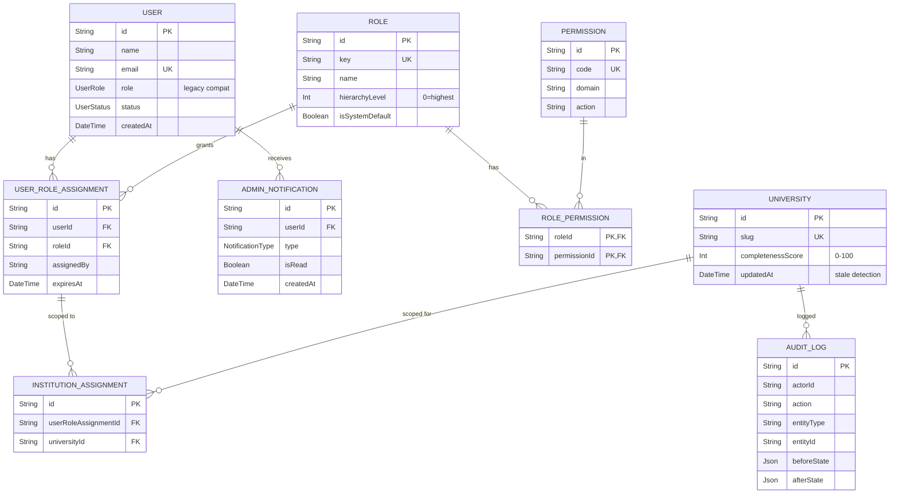

# Data Model: Admin Dashboard & Extensible RBAC

**Feature**: `003-admin-dashboard-rbac`
**Date**: 2026-08-26
**Author**: Platform Engineering (Principal Engineer Level)

---

## 1. Entity Relationship Diagram



---

## 2. Complete Prisma Schema Additions

```prisma
// ================================================================
// NEW ENUMS
// ================================================================

enum UserStatus {
  ACTIVE
  SUSPENDED
}

enum NotificationType {
  NEW_SUGGESTION
  DRAFT_SUBMITTED
  MODERATION_DECISION
  ROLE_CHANGE
  SYSTEM_ALERT
}

// ================================================================
// MODIFY: User model (additive fields only -- no removals)
// ================================================================

// Add to existing User model:
//   status             UserStatus          @default(ACTIVE)
//   roleAssignments    UserRoleAssignment[]
//   adminNotifications AdminNotification[]

// ================================================================
// MODIFY: University model (additive field + relation)
// ================================================================

// Add to existing University model:
//   completenessScore      Int                   @default(0)
//   institutionAssignments InstitutionAssignment[]
// Add to existing University indexes:
//   @@index([publishStatus, updatedAt])
//   @@index([completenessScore])

// ================================================================
// NEW MODELS
// ================================================================

model Role {
  id              String               @id @default(cuid())
  key             String               @unique   // e.g. "SUPER_ADMIN", "CONTENT_EDITOR"
  name            String                         // e.g. "Content Editor"
  description     String?
  hierarchyLevel  Int                  @default(100) // 0 = highest authority
  isSystemDefault Boolean              @default(false)
  createdAt       DateTime             @default(now())
  updatedAt       DateTime             @updatedAt

  permissions     RolePermission[]
  userAssignments UserRoleAssignment[]

  @@index([hierarchyLevel])
  @@map("roles")
}

model Permission {
  id          String           @id @default(cuid())
  code        String           @unique   // e.g. "content:publish"
  domain      String                     // e.g. "content"
  action      String                     // e.g. "publish"
  description String?
  createdAt   DateTime         @default(now())

  roles       RolePermission[]

  @@index([domain])
  @@map("permissions")
}

model RolePermission {
  roleId       String
  permissionId String

  role         Role       @relation(fields: [roleId], references: [id], onDelete: Cascade)
  permission   Permission @relation(fields: [permissionId], references: [id], onDelete: Cascade)

  @@id([roleId, permissionId])
  @@map("role_permissions")
}

model UserRoleAssignment {
  id           String    @id @default(cuid())
  userId       String
  roleId       String
  assignedBy   String    // actorId who made this assignment
  assignedAt   DateTime  @default(now())
  expiresAt    DateTime? // optional: for temporary access grants

  user                   User                  @relation(fields: [userId], references: [id], onDelete: Cascade)
  role                   Role                  @relation(fields: [roleId], references: [id], onDelete: Cascade)
  institutionAssignments InstitutionAssignment[]

  @@unique([userId, roleId])
  @@index([userId])
  @@index([roleId])
  @@map("user_role_assignments")
}

model InstitutionAssignment {
  id                   String             @id @default(cuid())
  userRoleAssignmentId String
  universityId         String

  userRoleAssignment   UserRoleAssignment @relation(fields: [userRoleAssignmentId], references: [id], onDelete: Cascade)
  university           University         @relation(fields: [universityId], references: [id], onDelete: Cascade)

  @@unique([userRoleAssignmentId, universityId])
  @@index([universityId])
  @@map("institution_assignments")
}

model AdminNotification {
  id        String           @id @default(cuid())
  userId    String           // target admin/editor
  title     String
  message   String
  type      NotificationType
  link      String?          // deep-link to target record
  isRead    Boolean          @default(false)
  createdAt DateTime         @default(now())

  user      User             @relation(fields: [userId], references: [id], onDelete: Cascade)

  @@index([userId, isRead])
  @@index([userId, createdAt])
  @@map("admin_notifications")
}
```

---

## 3. Entity Field Tables

### Role

| Field | Type | Constraints | Purpose |
|:---|:---|:---|:---|
| id | String | PK, cuid() | Unique identifier |
| key | String | UNIQUE | System key (e.g. "SUPER_ADMIN") |
| name | String | NOT NULL | Display name |
| description | String? | nullable | Human description |
| hierarchyLevel | Int | NOT NULL, default 100 | 0 = highest authority; enforces privilege boundaries |
| isSystemDefault | Boolean | default false | Protects against deletion of built-in roles |
| createdAt | DateTime | default now() | Creation timestamp |
| updatedAt | DateTime | @updatedAt | Last modification |

### Permission

| Field | Type | Constraints | Purpose |
|:---|:---|:---|:---|
| id | String | PK, cuid() | Unique identifier |
| code | String | UNIQUE | Permission code (e.g. "content:publish") |
| domain | String | NOT NULL | Permission domain (e.g. "content") |
| action | String | NOT NULL | Permission action (e.g. "publish") |
| description | String? | nullable | Human-readable capability description |
| createdAt | DateTime | default now() | Creation timestamp |

### UserRoleAssignment

| Field | Type | Constraints | Purpose |
|:---|:---|:---|:---|
| id | String | PK, cuid() | Unique identifier |
| userId | String | FK -> User.id, Cascade | Target user |
| roleId | String | FK -> Role.id, Cascade | Assigned role |
| assignedBy | String | NOT NULL | Actor ID who made assignment (audit trail) |
| assignedAt | DateTime | default now() | Assignment timestamp |
| expiresAt | DateTime? | nullable | Optional expiry for temporary access |

### InstitutionAssignment

| Field | Type | Constraints | Purpose |
|:---|:---|:---|:---|
| id | String | PK, cuid() | Unique identifier |
| userRoleAssignmentId | String | FK -> UserRoleAssignment.id, Cascade | Parent role assignment |
| universityId | String | FK -> University.id, Cascade | Scoped university |

**Unique**: `[userRoleAssignmentId, universityId]` prevents duplicate scope entries.

### AdminNotification

| Field | Type | Constraints | Purpose |
|:---|:---|:---|:---|
| id | String | PK, cuid() | Unique identifier |
| userId | String | FK -> User.id, Cascade | Target admin user |
| title | String | NOT NULL | Notification headline |
| message | String | NOT NULL | Full notification body |
| type | NotificationType | NOT NULL | Categorization enum |
| link | String? | nullable | Deep-link URL to target record |
| isRead | Boolean | default false | Read/unread state |
| createdAt | DateTime | default now() | Creation timestamp |

---

## 4. State Transition Diagrams

### UserStatus
```
ACTIVE ---[Admin suspends]---> SUSPENDED
SUSPENDED ---[Admin reactivates]---> ACTIVE
```

### PublishStatus (existing, for reference)
```
DRAFT ---[Admin/Editor publishes]---> PUBLISHED
PUBLISHED ---[Admin archives]---> ARCHIVED
DRAFT ---[Admin archives]---> ARCHIVED
ARCHIVED ---[Admin restores]---> DRAFT
```

### SuggestionStatus (existing, for reference)
```
PENDING ---[Moderator approves]---> MERGED
PENDING ---[Moderator rejects]---> REJECTED
```

### AuditLog Action Values (string enum)
```
CREATE | UPDATE | DELETE | ROLLBACK | BULK_PUBLISH | BULK_ARCHIVE |
ROLE_ASSIGN | ROLE_REVOKE | STATUS_CHANGE | MODERATION_APPROVE | MODERATION_REJECT
```

---

## 5. Completeness Score Algorithm

The `CompletenessScoreEngine` evaluates 14 weighted checkpoints totaling 100 points:

| # | Field/Check | Weight | Criteria |
|:---|:---|:---|:---|
| 1 | nameEn | 8 | Non-empty |
| 2 | nameAr | 8 | Non-empty |
| 3 | overviewEn | 10 | Length > 100 characters |
| 4 | overviewAr | 10 | Length > 100 characters |
| 5 | logoUrl | 8 | Non-empty URL |
| 6 | website | 5 | Non-empty URL |
| 7 | governorate | 5 | Non-empty |
| 8 | established | 5 | Non-null year |
| 9 | phones | 5 | Array length > 0 |
| 10 | emails | 5 | Array length > 0 |
| 11 | faculties | 10 | At least 1 faculty relation |
| 12 | degreePrograms | 10 | At least 1 program relation |
| 13 | tuition | 8 | At least 1 program with tuitionEgpPerYear set |
| 14 | accreditations | 3 | At least 1 accreditation relation |

**Total**: 100 points

**Score Thresholds**:
- < 60: Red badge (Critical gaps)
- 60-79: Amber badge (Needs improvement)
- >= 80: Green badge (Complete)

**Stale Detection**: `isStale = university.updatedAt < subMonths(new Date(), 6)` — computed at application layer, no additional DB column needed.

---

## 6. Permission Code Registry

| Code | Domain | Action | SUPER_ADMIN | ADMIN | CONTENT_EDITOR | UNIVERSITY_REP | COMMUNITY_MODERATOR | STUDENT | Description |
|:---|:---|:---|:---:|:---:|:---:|:---:|:---:|:---:|:---|
| `roles:manage` | roles | manage | YES | NO | NO | NO | NO | NO | Create/edit/delete dynamic roles |
| `users:manage_admins` | users | manage_admins | YES | NO | NO | NO | NO | NO | Promote/demote/suspend ADMIN accounts |
| `users:manage_staff` | users | manage_staff | YES | YES | NO | NO | NO | NO | Promote registered users to staff roles |
| `universities:create_delete` | universities | create_delete | YES | YES | NO | NO | NO | NO | Create new or delete universities |
| `universities:edit_global` | universities | edit_global | YES | YES | YES | NO | NO | NO | Edit any university platform-wide |
| `universities:edit_scoped` | universities | edit_scoped | YES | YES | YES | SCOPED | NO | NO | Edit within assigned institution scope |
| `content:draft` | content | draft | YES | YES | YES | YES | NO | NO | Save changes in draft state |
| `content:publish` | content | publish | YES | YES | YES | SCOPED | NO | NO | Publish live with cache invalidation |
| `data:rollback` | data | rollback | YES | YES | NO | NO | NO | NO | Atomic state reversion from audit log |
| `data:bulk_mutate` | data | bulk_mutate | YES | YES | NO | NO | NO | NO | Batch publish/archive operations |
| `moderation:review` | moderation | review | YES | YES | YES | SCOPED | YES | NO | Approve/reject community suggestions |
| `audit:view` | audit | view | YES | YES | NO | NO | NO | NO | View immutable audit log |
| `data:export_snapshot` | data | export_snapshot | YES | YES | NO | NO | NO | NO | Export database snapshots |

---

## 7. Seed Data Specification

### Default Roles (6)

```typescript
const DEFAULT_ROLES = [
  { key: 'SUPER_ADMIN',          name: 'Super Admin',           hierarchyLevel: 0,   isSystemDefault: true },
  { key: 'ADMIN',                name: 'Platform Admin',         hierarchyLevel: 10,  isSystemDefault: true },
  { key: 'CONTENT_EDITOR',       name: 'Content Editor',         hierarchyLevel: 20,  isSystemDefault: true },
  { key: 'UNIVERSITY_REP',       name: 'University Representative', hierarchyLevel: 30, isSystemDefault: true },
  { key: 'COMMUNITY_MODERATOR',  name: 'Community Moderator',    hierarchyLevel: 40,  isSystemDefault: true },
  { key: 'STUDENT',              name: 'Student',                hierarchyLevel: 100, isSystemDefault: true },
];
```

### Default Permissions (13)

```typescript
const DEFAULT_PERMISSIONS = [
  { code: 'roles:manage',              domain: 'roles',          action: 'manage'         },
  { code: 'users:manage_admins',       domain: 'users',          action: 'manage_admins'  },
  { code: 'users:manage_staff',        domain: 'users',          action: 'manage_staff'   },
  { code: 'universities:create_delete',domain: 'universities',   action: 'create_delete'  },
  { code: 'universities:edit_global',  domain: 'universities',   action: 'edit_global'    },
  { code: 'universities:edit_scoped',  domain: 'universities',   action: 'edit_scoped'    },
  { code: 'content:draft',             domain: 'content',        action: 'draft'          },
  { code: 'content:publish',           domain: 'content',        action: 'publish'        },
  { code: 'data:rollback',             domain: 'data',           action: 'rollback'       },
  { code: 'data:bulk_mutate',          domain: 'data',           action: 'bulk_mutate'    },
  { code: 'moderation:review',         domain: 'moderation',     action: 'review'         },
  { code: 'audit:view',                domain: 'audit',          action: 'view'           },
  { code: 'data:export_snapshot',      domain: 'data',           action: 'export_snapshot'},
];
```

### RolePermission Bindings

| Role | Permissions |
|:---|:---|
| SUPER_ADMIN | ALL 13 permissions |
| ADMIN | users:manage_staff, universities:create_delete, universities:edit_global, universities:edit_scoped, content:draft, content:publish, data:rollback, data:bulk_mutate, moderation:review, audit:view, data:export_snapshot |
| CONTENT_EDITOR | universities:edit_global, universities:edit_scoped, content:draft, content:publish, moderation:review |
| UNIVERSITY_REP | universities:edit_scoped, content:draft, content:publish, moderation:review |
| COMMUNITY_MODERATOR | moderation:review |
| STUDENT | (no admin permissions) |

---

## 8. Migration Strategy

### Additive-Only Approach

1. **No existing tables modified**: Only new columns added to `User` and `University`. All existing indexes and foreign keys preserved.
2. **BetterAuth Compatibility**: The `UserRole` enum on `User.role` is preserved. BetterAuth session continues to embed this field. Admin layouts can still read `session.user.role` as a coarse gate during the transition window.
3. **Migration Command**: `npx prisma migrate dev --name "add-rbac-tables-and-notification-system"`
4. **Rollout Sequence**:
   - Deploy schema migration (non-breaking)
   - Run `npm run db:seed` (creates roles, permissions, assigns SUPER_ADMIN)
   - Deploy application code with `withAdminAuth` HOC (backward compatible)
   - Monitor and validate for 1 sprint
   - Remove legacy `requireAdmin()` pattern in cleanup sprint

### Backward Compatibility Notes

- All existing admin Server Actions continue to work via `requireAdmin()` until migrated.
- New `withAdminAuth` HOC is opt-in per action during rollout phase.
- University queries continue to work as-is; `completenessScore` defaults to `0` until first recalculation.
- Existing `AuditLog` records remain intact; new RBAC actions add to them without modification.

---

## 9. All Composite Indexes

| Table | Index | Query Pattern |
|:---|:---|:---|
| user_role_assignments | `@@index([userId])` | Fetch all roles for a user |
| user_role_assignments | `@@index([roleId])` | Fetch all users with a role |
| user_role_assignments | `@@unique([userId, roleId])` | Prevent duplicate role assignments |
| institution_assignments | `@@unique([userRoleAssignmentId, universityId])` | Prevent duplicate scope |
| institution_assignments | `@@index([universityId])` | Find all users scoped to a university |
| role_permissions | `@@id([roleId, permissionId])` | Fast junction traversal |
| permissions | `@@index([domain])` | Filter permissions by domain |
| admin_notifications | `@@index([userId, isRead])` | Unread count queries |
| admin_notifications | `@@index([userId, createdAt])` | Paginated notification history |
| roles | `@@index([hierarchyLevel])` | Hierarchy boundary enforcement |
| universities | `@@index([publishStatus, updatedAt])` | Stale + status filtered lists |
| universities | `@@index([completenessScore])` | Filter by completeness threshold |
| audit_logs | `@@index([entityType, entityId])` | (existing) Rollback target lookup |
| audit_logs | `@@index([actorId])` | (existing) Actor history |
