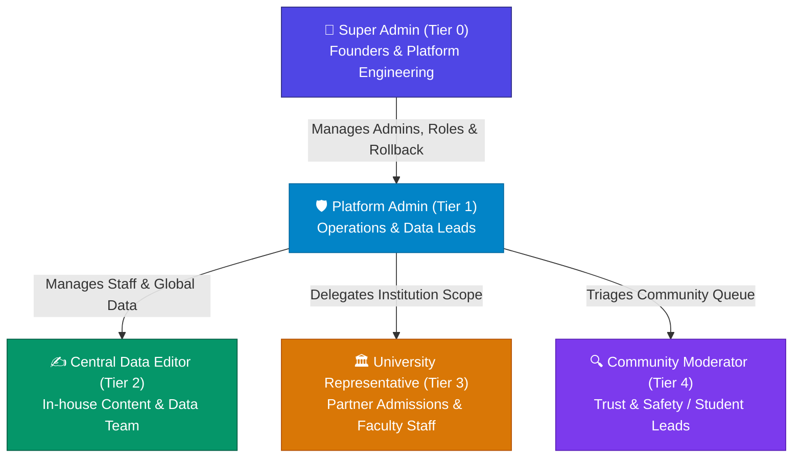

# Feature Specification: Unified Admin Dashboard & Extensible Role-Based Access Control (RBAC)

**Feature Branch**: `003-admin-dashboard-rbac`  
**Created**: 2026-08-26  
**Status**: Approved / Ready for Planning  
**Input**: User description: "Open a new Spec about the admin dashboard that gonna let the Admins and Editors (Other Roles gonna be added ) to Edit Data and Manage Users"

## 1. Executive Summary & Architecture Blueprint

The UniGate Admin Dashboard provides an enterprise-grade, secure, and extensible management portal for platform administrators, in-house editors, external university partner representatives, and moderation staff. 

Following the Zero-Trust / Least-Privilege architecture design, the platform features a **5-Tier Initial Role Matrix** backed by a **Database-Driven Dynamic RBAC Engine**, an **Immutable Audit & Atomic Rollback Subsystem**, **Real-Time Live Session Defense**, and **Automated Data Quality & Completeness Monitoring**:

---

## 2. Core Initial Roles & Permissions Matrix

### 2.1 The 5 Day-1 Roles

1. **`SUPER_ADMIN` (Tier 0 — Platform Owners)**:
   - **Scope**: Platform Governance, Security, & System Configuration.
   - **Capabilities**: Manage Admins, define/customize dynamic roles and permissions in DB, execute atomic data rollbacks, trigger full database snapshots, execute emergency account lockouts.
   - **Audience**: Founders, CTO, Lead Systems Engineers (strictly 2–3 accounts).

2. **`ADMIN` (Tier 1 — Operations & Data Leads)**:
   - **Scope**: Platform-wide Content, Staff Management, & Rollback Operations.
   - **Capabilities**: Global CRUD across all universities, faculties, programs, tuition matrices; promote registered users to staff roles (`CONTENT_EDITOR`, `UNIVERSITY_REP`, `COMMUNITY_MODERATOR`); assign institution scopes; execute entity rollbacks; review full audit logs; direct live publishing with instant cache invalidation; perform bulk operations.
   - **Audience**: Head of Operations, Lead Data Architect, Community Director.

3. **`CONTENT_EDITOR` (Tier 2 — In-House Content Team)**:
   - **Scope**: Global Catalog Accuracy & Data Expansion.
   - **Capabilities**: Global read and edit across all universities, faculties, degree programs, tuition fees, and bilingual descriptions. Save as `PUBLISHED` or `DRAFT`.
   - **Guardrails**: Cannot delete entire universities, cannot execute rollbacks, cannot manage users, cannot alter platform settings.
   - **Audience**: Data entry team, content writers, interns, researchers.

4. **`UNIVERSITY_REP` (Tier 3 — Partner University Staff)**:
   - **Scope**: Scoped Institution Delegation (Single or Multi-University Binding).
   - **Capabilities**: Read-all platform universities for benchmarking. Edit, update tuition, manage faculties/programs, and submit updates **strictly for their assigned university ID(s)**. Can save drafts or publish within scope.
   - **Guardrails**: Zero mutation access outside assigned institution scope; cannot execute rollbacks or user management.
   - **Audience**: University admissions officers, PR reps, faculty deans (e.g. Cairo University, AUC, GUC).

5. **`COMMUNITY_MODERATOR` (Tier 4 — Trust & Safety)**:
   - **Scope**: Crowdsourced Suggestion Moderation.
   - **Capabilities**: Dedicated moderation queue access (`/admin/suggestions`). Review student-submitted tuition corrections with side-by-side visual diffs. Approve & Apply (or Reject) suggestions.
   - **Guardrails**: No direct arbitrary database mutation without suggestion context.
   - **Audience**: Student ambassadors, customer support agents, moderation leads.

6. **`STUDENT` (Tier 5 — Baseline Public User)**:
   - Default role upon registration. Read-only catalog browsing, bookmarks, comparison tools, and submitting correction suggestions.

---

### 2.2 Role & Permission Matrix at a Glance

| Permission Code | Capability Description | `SUPER_ADMIN` | `ADMIN` | `CONTENT_EDITOR` | `UNIVERSITY_REP` | `COMMUNITY_MODERATOR` | `STUDENT` |
|:---|:---|:---:|:---:|:---:|:---:|:---:|:---:|
| `roles:manage` | Create, customize, & delete dynamic roles & permissions | ✅ | ❌ | ❌ | ❌ | ❌ | ❌ |
| `users:manage_admins` | Promote, demote, or suspend `ADMIN` accounts | ✅ | ❌ | ❌ | ❌ | ❌ | ❌ |
| `users:manage_staff` | Promote registered users to Editor, Rep, Moderator | ✅ | ✅ | ❌ | ❌ | ❌ | ❌ |
| `universities:create_delete` | Create new universities or delete existing ones | ✅ | ✅ | ❌ | ❌ | ❌ | ❌ |
| `universities:edit_global` | Edit any university profile & tuition platform-wide | ✅ | ✅ | ✅ | ❌ | ❌ | ❌ |
| `universities:edit_scoped` | Edit university data only within assigned institution scope | Global | Global | Global | ✅ *(Assigned)* | ❌ | ❌ |
| `content:draft` | Create and edit draft changes without publishing live | ✅ | ✅ | ✅ | ✅ | ❌ | ❌ |
| `content:publish` | Push data live with automatic ISR cache invalidation | ✅ | ✅ | ✅ | ✅ *(Scoped)* | ❌ | ❌ |
| `data:rollback` | Execute atomic state reversion from audit snapshot | ✅ | ✅ | ❌ | ❌ | ❌ | ❌ |
| `data:bulk_mutate` | Perform batch publish/archive operations on multiple records | ✅ | ✅ | ❌ | ❌ | ❌ | ❌ |
| `moderation:review` | Review, approve, and reject community suggestions | ✅ | ✅ | ✅ | ✅ *(Scoped)* | ✅ | ❌ |
| `audit:view` | View and filter immutable system mutation logs | ✅ | ✅ | ❌ | ❌ | ❌ | ❌ |
| `data:export_snapshot` | Export complete database JSON snapshots | ✅ | ✅ | ❌ | ❌ | ❌ | ❌ |

---

## 3. User Scenarios & Testing *(mandatory)*

### User Story 1 - Role-Gated Operational Dashboard Hub (Priority: P1)

As an authenticated staff member (`Super Admin`, `Admin`, `Content Editor`, `University Rep`, or `Community Moderator`), I want to access a centralized operational dashboard (`/admin`) tailored to my role with live KPI cards, quick actions, in-app notification alerts, and data quality monitors, so that I can immediately oversee platform status and execute my responsibilities securely.

**Why this priority**: Foundational entry point for all administrative functions.

**Independent Test**: Log in with each role and verify that navigation links, KPI metrics, action cards, and notification drawers strictly reflect the user's assigned permissions and institution scopes.

**Acceptance Scenarios**:
1. **Given** an authenticated `ADMIN`, **When** visiting `/admin`, **Then** total published universities, active degree programs, pending suggestion counter, staff counts, data quality breakdown, and recent audit activity feed are displayed with full navigation.
2. **Given** an authenticated `UNIVERSITY_REP` assigned to "Cairo University", **When** visiting `/admin`, **Then** the dashboard surfaces a quick-edit link for Cairo University, pending suggestion count for Cairo University, and hides user management, global role settings, and full audit logs.
3. **Given** an unauthenticated user or standard `STUDENT`, **When** requesting any `/admin/*` route, **Then** access is denied with a 403 redirect to sign-in.

---

### User Story 2 - User Promotion & Hierarchical Lifecycle Governance (Priority: P1)

As an authorized Administrator, I want to search registered platform users, promote them to appropriate staff roles (`Admin`, `Content Editor`, `University Rep`, `Moderator`, or custom roles), assign institution scopes where applicable, and adjust account statuses (`Active`, `Suspended`), so that team access is governed securely without privilege escalation.

**Why this priority**: Establishes staff onboarding and strictly prevents unauthorized role elevation.

**Independent Test**: An Admin locates a registered student account, promotes them to `University Rep` for "GUC", verifies role assignment in the DB, and confirms the user immediately inherits scoped editing capabilities upon login.

**Acceptance Scenarios**:
1. **Given** an Admin in User Management, **When** searching by email/name or filtering by role/status, **Then** matching user records display with current role, status, institution affiliations, and registration timestamps.
2. **Given** an Admin promoting a user to `UNIVERSITY_REP`, **When** selecting target institution(s) and saving, **Then** `UserRoleAssignment` and `InstitutionAssignment` records persist, and an audit log is created.
3. **Given** an `ADMIN` attempting to promote a user to `SUPER_ADMIN` or modify a peer `ADMIN`, **When** initiated, **Then** the system blocks the action enforcing strict hierarchical privilege safeguards.
4. **Given** the sole remaining `SUPER_ADMIN` attempting to demote or suspend their own account, **When** initiated, **Then** the system blocks the action preventing platform lockout.
5. **Given** an Admin suspending a user account, **When** confirmed, **Then** all active sessions for that user are immediately terminated on their next request.

---

### User Story 3 - Academic Catalog Editing with Scoped Mutability & Quality Scoring (Priority: P1)

As an Admin, Content Editor, or University Representative, I want to browse the complete university directory with automated Completeness Scores (0–100%) and "Stale Data" badges, and edit institutional details, faculties, degree programs, tuition matrices (EGP & USD), and accreditations according to my assigned permissions, so that academic information is complete, verified, and instantly published.

**Why this priority**: Core platform value proposition delivering accurate data to prospective students.

**Independent Test**: An Editor filters by "Incomplete Profiles (<80%)", opens a flagged university, completes missing bilingual fields and tuition numbers, saves changes, and observes the completeness score jump to 100% with public cache revalidated in under 2 seconds.

**Acceptance Scenarios**:
1. **Given** an Editor or Rep browsing the university catalog, **When** viewing institutions, **Then** all universities are viewable with completeness scores and stale badges, but mutation actions (`Edit`, `Add Faculty/Program`, `Archive`) are enabled strictly for assigned institutions (or globally for `ADMIN` / `CONTENT_EDITOR`).
2. **Given** a university profile whose tuition has not been updated for > 6 months, **When** rendered in the catalog table, **Then** a "Needs Annual Review" warning badge is displayed with filter chip support.
3. **Given** an authorized user updating tuition rates or program details, **When** saving, **Then** bilingual validations execute, changes persist transactionally, and public ISR cache tags are invalidated within 2.0 seconds.
4. **Given** a University Rep attempting to update an unassigned institution via direct API or server action, **When** invoked, **Then** the request is rejected with a 403 Forbidden error.

---

### User Story 4 - Atomic Data Rollback & Revision History (Priority: P1) 🌟

As a Platform Admin or Super Admin, I want to inspect historical data mutation entries in the Audit Log and execute an atomic rollback to restore any previous entity snapshot with automated forward-audit logging and cache revalidation, so that accidental deletions or erroneous data changes can be instantly recovered with zero data loss.

**Why this priority**: Enterprise safety net preventing irreversible data corruption or accidental overwrite outages.

**Independent Test**: An Editor accidentally deletes three degree programs from a university; an Admin navigates to `/admin/audit-log`, clicks "Revert to this Version" on the pre-deletion audit entry, confirms the rollback dialog, and verifies that the previous programs are restored transactionally with a new `ROLLBACK` audit entry generated.

**Acceptance Scenarios**:
1. **Given** an Admin viewing an audit log entry in `/admin/audit-log`, **When** inspecting the before/after state diff, **Then** a "Revert to this Version" button is available with a pre-flight validation check.
2. **Given** an Admin confirming a rollback, **When** executed, **Then** the target entity's state is restored from the `beforeState` JSON snapshot inside a new database transaction, foreign-key constraints are verified, a new `AuditLog` entry with action `ROLLBACK` is appended, and public cache tags are revalidated within 2.0 seconds.
3. **Given** a user with `CONTENT_EDITOR` or `UNIVERSITY_REP` role viewing the audit log or trying to trigger a rollback, **When** attempted, **Then** the rollback action is disabled in the UI and rejected with a 403 on the server action.
4. **Given** an attempted rollback where required foreign key relationships (e.g. parent faculty) no longer exist, **When** evaluated, **Then** the system prevents the rollback and displays an actionable error message detailing the broken dependency.

---

### User Story 5 - Real-Time Live Session Defense & Permission Staleness Protocol (Priority: P1) 🛡️

As a Platform Security Lead, I want every administrative Server Action to re-verify the acting user's live account status (`ACTIVE` vs `SUSPENDED`) and current role/institution permissions directly against PostgreSQL inside the transactional action boundary, so that demotions, revocations, and account suspensions take effect instantaneously without waiting for cookie/token expiration.

**Why this priority**: Eliminates the critical security vulnerability of stale JWT/session tokens where a suspended or demoted rogue staff member continues mutating live data.

**Independent Test**: Suspend an active Editor's account in User Management while they have an open edit form in another browser window; submit the edit form and verify that the request is immediately rejected with a 403 Forbidden error, the session cookie is invalidated, and the user is redirected to sign-in.

**Acceptance Scenarios**:
1. **Given** an authenticated user whose account status is toggled to `SUSPENDED`, **When** they invoke any administrative Server Action, **Then** the live database check fails, the mutation is aborted, and a 403 error is returned.
2. **Given** an Editor whose institution scope is modified from "Cairo University" to "GUC", **When** they submit a pending mutation on Cairo University, **Then** the server action re-validates the live scope and rejects the mutation.

---

### User Story 6 - In-App Administrative Alerts & Workflow Notification Center (Priority: P2) 🔔

As an Admin, Editor, or University Representative, I want an in-app notification center in the dashboard header with unread badge counters and deep-links, so that I receive immediate alerts when new community suggestions arrive, drafts are submitted for review, or moderation outcomes are decided.

**Why this priority**: Eliminates external communication silos and keeps editorial workflows moving rapidly.

**Independent Test**: A student submits a correction suggestion; verify that the Admin's notification bell increments its unread counter, displays the event in the dropdown, and navigates directly to the review modal upon clicking.

**Acceptance Scenarios**:
1. **Given** a new community suggestion or scoped draft submission, **When** created, **Then** an `AdminNotification` record is generated for relevant Admins and scoped Reps, and the header notification bell increments.
2. **Given** a staff member clicking an item in the notification dropdown, **When** clicked, **Then** the notification is marked as read and the browser navigates directly to the target record.

---

### User Story 7 - Batch / Bulk Catalog Operations (Priority: P2) ⚡

As an Admin or Content Editor, I want multi-select capabilities in the University and Degree Program tables to perform batch operations (Bulk Publish, Bulk Archive, Export Selected) with atomic transactional execution and individual audit logging, so that large-scale seasonal catalog updates can be executed in seconds.

**Why this priority**: Dramatically accelerates operations during nationwide university onboarding and semester intake transitions.

**Independent Test**: Select 10 drafted degree programs in the catalog table, click "Bulk Publish" in the floating action bar, confirm the modal, and verify all 10 programs transition to `PUBLISHED` with 10 corresponding audit records generated and cache revalidated.

**Acceptance Scenarios**:
1. **Given** an Admin selecting multiple rows via checkboxes in a catalog table, **When** 1 or more rows are selected, **Then** a floating batch action bar appears with options (`Bulk Publish`, `Bulk Archive`, `Export Selected JSON/CSV`).
2. **Given** an Admin confirming a bulk status mutation, **When** executed, **Then** all selected records update in an atomic transaction, individual `AuditLog` records are generated per entity, and public cache tags are revalidated.
3. **Given** a University Rep interacting with the table, **When** selecting rows, **Then** bulk actions are restricted strictly to records within their assigned institution scope.

---

### User Story 8 - Extensible Dynamic Role & Permission Engine (Priority: P2)

As a Super Admin, I want to create and customize new roles (such as "Admissions Officer", "Finance Auditor", or "Regional Coordinator") with fine-grained permission checkboxes across system domains, so that the platform can expand its operational team without codebase modifications or schema migrations.

**Why this priority**: Enables dynamic business expansion as new university partnerships and administrative workflows are introduced.

**Independent Test**: A Super Admin creates a new role "Admissions Officer" with `content:draft` and `moderation:review` permissions, assigns it to a test user, and confirms the user can save drafts and moderate suggestions but cannot publish live.

**Acceptance Scenarios**:
1. **Given** a Super Admin on the Role Management screen, **When** creating a new role with custom name, description, and selected permission flags, **Then** the role is saved to the `Role` table and becomes selectable in User Management.
2. **Given** an existing custom role having its permission set modified, **When** saved, **Then** all users assigned to that role immediately receive updated capabilities across the dashboard.
3. **Given** default system roles (`SUPER_ADMIN`, `ADMIN`, `CONTENT_EDITOR`, `UNIVERSITY_REP`, `COMMUNITY_MODERATOR`, `STUDENT`), **When** viewed in the editor, **Then** core system keys are protected against deletion.

---

### User Story 9 - Community Suggestion Moderation Queue (Priority: P2)

As a Community Moderator, Editor, or Admin, I want a centralized moderation queue to review crowdsourced data corrections with side-by-side visual diffs, and approve, modify, or reject submissions with one click, so that community updates are safely verified and applied.

**Why this priority**: Maintains catalog freshness through crowd-sourced intelligence while safeguarding database integrity.

**Independent Test**: Review a pending tuition suggestion submitted by a student, inspect the before/after values, click "Approve & Apply", and confirm the live university record updates with a resolved suggestion status.

**Acceptance Scenarios**:
1. **Given** a moderator in `/admin/suggestions`, **When** selecting a pending suggestion, **Then** submitter notes, evidence URL, and side-by-side diff against live data are displayed.
2. **Given** a moderator clicking "Approve & Apply", **When** confirmed, **Then** the university record updates, an audit record is logged, the suggestion transitions to `MERGED`, and public cache tags are revalidated.
3. **Given** a moderator clicking "Reject" with optional feedback, **When** confirmed, **Then** status updates to `REJECTED` without altering live data.

---

### Edge Cases & Safeguards

- **Concurrent Admin Edits**: Optimistic concurrency locking via `updatedAt` timestamps detects simultaneous saves and presents a side-by-side conflict resolution dialog.
- **Sole Admin Safeguard**: System blocks self-demotion, self-suspension, or self-deletion if the user is the last active `ADMIN` or `SUPER_ADMIN`.
- **Immediate Session Invalidation**: Role demotions or account suspensions immediately revoke permissions on the next incoming request.
- **Hierarchical Privilege Escalation**: Admins cannot create Super Admins or edit accounts equal to or above their rank.
- **Institution Scope Enforcement**: University Reps attempting to mutate unassigned universities are blocked at the server action and repository layers.
- **Draft vs. Live Publishing**: Users lacking `content:publish` can only save records in `DRAFT` state; publishing buttons are disabled.
- **Rollback Dependency Violations**: If a rollback attempts to restore an entity referencing a deleted parent or invalid FK, the operation is blocked with a descriptive pre-flight validation error.

---

## 4. Requirements *(mandatory)*

### Functional Requirements

#### User & Role Management
- **FR-001**: System MUST provide a secure User Management dashboard accessible exclusively to authorized Admin roles.
- **FR-002**: System MUST support searching, sorting, and filtering registered platform users by email, name, role, status (`Active`, `Suspended`), and institution affiliation.
- **FR-003**: System MUST allow Admins to promote existing registered platform users to administrative or editing roles.
- **FR-004**: System MUST allow Admins to assign, change, or revoke roles for existing user accounts subject to hierarchical privilege rules.
- **FR-005**: System MUST allow Admins to toggle user account status between `Active` and `Suspended`.
- **FR-006**: System MUST enforce protection rules preventing the last active Administrator from demoting, suspending, or deleting their own account.
- **FR-007**: System MUST enforce strict hierarchical privilege boundaries (`SUPER_ADMIN` > `ADMIN` > Custom Roles / `CONTENT_EDITOR` / `UNIVERSITY_REP` / `COMMUNITY_MODERATOR` > `STUDENT`).
- **FR-008**: System MUST immediately terminate active sessions and revoke permissions upon account suspension or role demotion.

#### Extensible Dynamic RBAC
- **FR-009**: System MUST persist dynamic roles and permissions in relational database tables (`Role`, `Permission`, `RolePermission`, `UserRoleAssignment`, `InstitutionAssignment`).
- **FR-010**: System MUST support the 5 default system roles on launch: `SUPER_ADMIN`, `ADMIN`, `CONTENT_EDITOR`, `UNIVERSITY_REP`, `COMMUNITY_MODERATOR`, and `STUDENT`.
- **FR-011**: System MUST allow Super Admins to create, edit, and delete custom roles with custom keys, display names, and descriptions.
- **FR-012**: System MUST provide a granular permission registry supporting toggles across domains (e.g., `roles:manage`, `users:manage_admins`, `users:manage_staff`, `universities:create_delete`, `universities:edit_global`, `universities:edit_scoped`, `content:draft`, `content:publish`, `data:rollback`, `data:bulk_mutate`, `moderation:review`, `audit:view`, `data:export_snapshot`).
- **FR-013**: System MUST support institution-scoped permissions via `InstitutionAssignment`, allowing specific editors and university reps to be bound to one or more designated university IDs (or global access).
- **FR-014**: System MUST support independent toggling of `content:draft` and `content:publish` per role.

#### Academic Catalog & Data Quality Management
- **FR-015**: System MUST provide visual management interfaces for Universities, Faculties, Departments, Degree Programs, Accreditations, and Contacts.
- **FR-016**: System MUST allow editors and reps to browse all universities in read-only mode, with mutation controls enabled only for assigned institutions.
- **FR-017**: System MUST support bilingual (Arabic and English) editing across all textual entity fields.
- **FR-018**: System MUST calculate and display a real-time Profile Completeness Score (0–100%) for each university profile based on mandatory data checkpoints.
- **FR-019**: System MUST automatically flag universities untouched for > 6 months with a "Needs Annual Review" stale badge.
- **FR-020**: System MUST support `DRAFT`, `PUBLISHED`, and `ARCHIVED` lifecycle states for university profiles and degree programs.
- **FR-021**: System MUST automatically trigger public ISR cache invalidation (`revalidateTag`, `revalidatePath`) within 2 seconds whenever published data is modified.
- **FR-022**: System MUST enforce optimistic concurrency locking via version timestamps to prevent silent overwrites.

#### Data Rollback & Revision History Subsystem
- **FR-023**: System MUST allow Admins and Super Admins to execute atomic entity-level rollbacks from any historical audit log entry.
- **FR-024**: Rollback execution MUST restore the target entity's state from the `beforeState` JSON snapshot inside a database transaction and create a new `AuditLog` entry with action `ROLLBACK`.
- **FR-025**: Rollback execution MUST run pre-flight integrity validation to ensure all required foreign-key relations exist prior to reversion.
- **FR-026**: Rollback execution MUST trigger public ISR cache invalidation within 2.0 seconds of successful execution.

#### Real-Time Live Session Defense
- **FR-027**: Every administrative Server Action MUST re-validate the acting user's live account status (`ACTIVE`) and current role/institution permissions directly against PostgreSQL inside the execution boundary.
- **FR-028**: Server Actions MUST reject requests from suspended or demoted users with an immediate typed `403 Forbidden` response and session invalidation.

#### In-App Notification Center
- **FR-029**: System MUST persist administrative notifications in an `AdminNotification` relational table.
- **FR-030**: System MUST display an unread badge counter in the Admin Header and provide a notification drawer with direct deep-links for events (New Suggestions, Draft Submissions, Moderation Decisions).

#### Batch / Bulk Catalog Operations
- **FR-031**: System MUST provide multi-select checkboxes in catalog tables triggering a floating action bar for bulk status changes (`Bulk Publish`, `Bulk Archive`) and bulk exports.
- **FR-032**: Bulk operations MUST execute atomically in a single transaction, emit individual `AuditLog` records for every affected entity, and revalidate public caches.

#### Community Suggestion Moderation
- **FR-033**: System MUST provide a dedicated moderation queue interface displaying community data corrections with status indicators (`PENDING`, `MERGED`, `REJECTED`).
- **FR-034**: System MUST display a side-by-side visual diff comparing current live data against submitted proposed changes.
- **FR-035**: System MUST allow moderators to approve & apply, modify before applying, or reject suggestions with one click.
- **FR-036**: System MUST record moderation decisions and automatically update live university records upon approval.

#### Governance & Audit Trail
- **FR-037**: System MUST create an immutable, append-only audit record for 100% of administrative mutations (data create/update/delete, rollbacks, bulk actions, role assignments, user status changes, moderation decisions).
- **FR-038**: System MUST record actor ID, email, IP address, timestamp, action type, entity ID, and before/after state payloads for every audit log entry.
- **FR-039**: System MUST provide an interactive Audit Log explorer with filtering by actor, entity type, action type, and date range.
- **FR-040**: System MUST support exporting filtered audit records to CSV and JSON formats.

---

### Key Entities

- **User**: Core user account entity extended with account status (`ACTIVE`, `SUSPENDED`).
- **Role**: Dynamic role definition entity (`id`, `key`, `name`, `description`, `isSystemDefault`, `hierarchyLevel`, `createdAt`, `updatedAt`).
- **Permission**: Discrete capability entity (`id`, `code`, `domain`, `action`, `description`).
- **RolePermission**: Many-to-many junction binding `Role` to `Permission`.
- **UserRoleAssignment**: Junction binding `User` to `Role`, linking assigned institutions (`InstitutionAssignment`).
- **InstitutionAssignment**: Junction binding `UserRoleAssignment` to `University` for scoped permissions.
- **University**: Top-level institution entity with bilingual metadata, publish status (`DRAFT`, `PUBLISHED`, `ARCHIVED`), and relations.
- **Faculty**: Academic division nested under university.
- **DegreeProgram**: Degree offering nested under faculty/university with numeric tuition (EGP/USD).
- **Suggestion**: Community correction ticket with submitter info, field diffs, and moderation status.
- **AuditLog**: Immutable, INSERT-only operational log record storing JSON before/after snapshots for rollback execution.
- **AdminNotification**: Internal staff notification entity (`id`, `userId`, `title`, `message`, `type`, `link`, `isRead`, `createdAt`).

---

## 5. Success Criteria *(mandatory)*

### Measurable Outcomes

- **SC-001**: Role-based access control and navigation gating enforce 100% authorization checks across all UI views and server mutation endpoints with zero permission leakage.
- **SC-002**: An administrator can execute an atomic data rollback from the Audit Log in **under 2.0 seconds** with full forward-audit trail and cache revalidation.
- **SC-003**: Account suspension or role demotion takes effect instantaneously (< 50ms) on the very next Server Action invocation with zero stale session vulnerability.
- **SC-004**: An administrator can find a registered platform user and promote/assign their role and institution scope in **under 30 seconds**.
- **SC-005**: Authorized editors can modify academic data (tuition, program details, faculty info) with live public updates reflected in **under 2.0 seconds** without application redeployment.
- **SC-006**: Creation and assignment of a new custom role with distinct permissions takes effect immediately across all dashboard operations without system downtime or code changes.
- **SC-007**: 100% of administrative create, update, delete, rollback, bulk action, role change, and moderation events produce an immutable audit log record.
- **SC-008**: Moderation team can review and resolve (approve/reject) a community suggestion in **under 30 seconds** using the side-by-side visual diff interface.
- **SC-009**: Bulk status operations on 50+ degree programs execute transactionally in **under 3 seconds**.
- **SC-010**: User management, catalog lists, and audit log views load and filter 10,000+ records in **under 500ms**.

---

## 6. Assumptions

- **Base Authentication Engine**: BetterAuth handles user authentication, credential verification, and session cookies.
- **Dual-Language Support**: The admin interface and catalog entities support English and Arabic with standard RTL/LTR layout handling.
- **Database Consistency**: PostgreSQL provides ACID transaction guarantees for role assignments, user status updates, audit logging, rollbacks, and bulk operations.
- **Client Search & Invalidation Integration**: Admin mutations integrate directly with the existing caching and slim search index generation pipeline.
