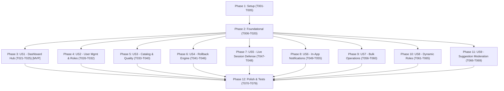

# Tasks: Unified Admin Dashboard & Extensible RBAC

**Input**: Design documents from `specs/003-admin-dashboard-rbac/` (`spec.md`, `plan.md`, `research.md`, `data-model.md`, `contracts/rbac-actions.contract.md`)  
**Prerequisites**: `plan.md`, `spec.md`, `data-model.md`, `contracts/`  
**Status**: Ready for Implementation  

## Format: `[ID] [P?] [Story?] Description with file path`
- **[P]**: Can run in parallel (different files, no dependencies)
- **[Story]**: User story mapping (`[US1]` through `[US9]`) for story-specific phases

---

## Phase 1: Setup (Shared Infrastructure & Types)

**Purpose**: Project types, validation schemas, and environment configuration

- [ ] T001 [P] Define core RBAC TypeScript types (`UserContext`, `PermissionCode`, `ActionResult<T>`) in `src/types/rbac.types.ts`
- [ ] T002 [P] Define user, role, and notification DTO interfaces in `src/types/user.types.ts`, `src/types/role.types.ts`, `src/types/notification.types.ts`
- [ ] T003 [P] Add `INITIAL_SUPER_ADMIN_EMAIL` to environment variable validation in `src/env.ts`
- [ ] T004 [P] Create Zod schemas for user management and role operations in `src/schemas/user.schema.ts` and `src/schemas/role.schema.ts`
- [ ] T005 [P] Create Zod schema for bulk catalog operations in `src/schemas/bulk.schema.ts`

---

## Phase 2: Foundational (Blocking Prerequisites)

**Purpose**: Core database schema, repository interfaces, security HOC, and bootstrap provisioning

**⚠️ CRITICAL**: Must be completed before user story implementation begins

- [ ] T006 Extend Prisma schema with additive RBAC models (`Role`, `Permission`, `RolePermission`, `UserRoleAssignment`, `InstitutionAssignment`, `AdminNotification`, `UserStatus`, `NotificationType`, `completenessScore`) in `prisma/schema.prisma`
- [ ] T007 Run Prisma migration `npx prisma migrate dev --name add_rbac_tables_and_notifications` to generate database migration
- [ ] T008 Implement secure One-Time Bootstrap Provisioning Protocol in `prisma/seed.ts` (seeds 6 default roles, 13 permissions, bindings, and elevates `INITIAL_SUPER_ADMIN_EMAIL` with permanent lock)
- [ ] T009 [P] Create repository interfaces (`IUserRepository`, `IRoleRepository`, `IPermissionRepository`, `IUserRoleAssignmentRepository`, `IAdminNotificationRepository`) in `src/server/repositories/interfaces/`
- [ ] T010 [P] Implement `PostgresUserRepository` in `src/server/repositories/PostgresUserRepository.ts`
- [ ] T011 [P] Implement `PostgresRoleRepository` in `src/server/repositories/PostgresRoleRepository.ts`
- [ ] T012 [P] Implement `PostgresPermissionRepository` in `src/server/repositories/PostgresPermissionRepository.ts`
- [ ] T013 [P] Implement `PostgresUserRoleAssignmentRepository` in `src/server/repositories/PostgresUserRoleAssignmentRepository.ts`
- [ ] T014 [P] Implement `PostgresAdminNotificationRepository` in `src/server/repositories/PostgresAdminNotificationRepository.ts`
- [ ] T015 [P] Implement mappers (`UserMapper`, `RoleMapper`, `AdminNotificationMapper`) in `src/server/mappers/`
- [ ] T016 Implement `RbacService` with `hasPermission()` and React `cache()` memoized `getUserPermissions()` in `src/server/services/RbacService.ts`
- [ ] T017 Implement Zero-Trust `withAdminAuth` Higher-Order Server Action wrapper in `src/server/actions/withAdminAuth.ts`
- [ ] T018 Wire new repositories and services into dependency injection container in `src/lib/di.ts`
- [ ] T019 Implement client-side `PermissionContext` and `usePermission` hook in `src/contexts/PermissionContext.tsx` and `src/hooks/usePermission.ts`
- [ ] T020 Update root middleware to protect `/admin/:path*` in `src/middleware.ts`

**Checkpoint**: Foundation ready — database migrated, bootstrap functional, and security HOC operational.

---

## Phase 3: User Story 1 — Role-Gated Operational Dashboard Hub (Priority: P1) 🎯 MVP

**Goal**: Centralized `/admin` dashboard displaying role-tailored KPIs, action cards, and permission-aware navigation

**Independent Test**: Log in as `SUPER_ADMIN`, `ADMIN`, and `UNIVERSITY_REP`; verify navigation items, KPI cards, and action links strictly reflect assigned roles.

- [ ] T021 [US1] Create KPI aggregation methods in `src/server/services/AdminCatalogService.ts` (counts for universities, programs, pending suggestions, active staff, data quality metrics)
- [ ] T022 [US1] Update `AdminLayout` to load live `UserContext` and wrap client tree with `PermissionContext` in `src/app/admin/layout.tsx`
- [ ] T023 [US1] Update `AdminSidebar` navigation to conditionally render links based on user permissions in `src/components/admin/layout/AdminSidebar.tsx`
- [ ] T024 [US1] Implement role-tailored KPI dashboard cards and quick-action widgets in `src/app/admin/page.tsx`
- [ ] T025 [US1] Implement `PermissionGuard` client component for conditional UI rendering in `src/components/admin/shared/PermissionGuard.tsx`

**Checkpoint**: User Story 1 complete — dashboard hub functional with role-based navigation and KPIs.

---

## Phase 4: User Story 2 — User Promotion & Hierarchical Governance (Priority: P1)

**Goal**: Administrators can search users, promote to staff roles, assign institution scopes, and suspend/activate accounts with hierarchical safeguards

**Independent Test**: An Admin locates a registered student, promotes them to `University Rep` for Cairo University, verifies role/scope in DB, and confirms the user cannot self-escalate or edit other universities.

- [ ] T026 [US2] Implement `UserManagementService` in `src/server/services/UserManagementService.ts` (search users, promote, revoke, assign institution scopes, toggle status, sole-admin protection, hierarchy validation)
- [ ] T027 [US2] Create Server Actions for user lifecycle (`promoteUserAction`, `revokeUserRoleAction`, `setUserStatusAction`) using `withAdminAuth` in `src/server/actions/admin/user.admin.actions.ts`
- [ ] T028 [P] [US2] Implement `UserTable` component with search, role filter, status badge, and action menu in `src/components/admin/users/UserTable.tsx`
- [ ] T029 [P] [US2] Implement `RoleAssignmentSheet` component with dynamic role selector and searchable institution multi-select in `src/components/admin/users/RoleAssignmentSheet.tsx`
- [ ] T030 [P] [US2] Implement `UserStatusToggle` confirmation dialog in `src/components/admin/users/UserStatusToggle.tsx`
- [ ] T031 [US2] Create User Management page with paginated staff table in `src/app/admin/users/page.tsx`
- [ ] T032 [US2] Create User Profile detail & permission audit view in `src/app/admin/users/[id]/page.tsx`

**Checkpoint**: User Story 2 complete — staff onboarding, role promotion, and hierarchical security active.

---

## Phase 5: User Story 3 — Academic Catalog Editing, Scoped Mutability & Quality Scoring (Priority: P1)

**Goal**: Full catalog CRUD with 0–100% Completeness Score, "Needs Annual Review" stale data badges, and strict institution scope enforcement

**Independent Test**: An Editor filters by incomplete profiles (<80%), updates missing bilingual fields and tuition numbers, saves changes, and observes completeness score increase to 100% with public cache invalidated in <2s.

- [ ] T033 [P] [US3] Implement 14-checkpoint pure function `CompletenessScoreEngine` in `src/server/services/CompletenessScoreEngine.ts`
- [ ] T034 [US3] Update `AdminCatalogService` in `src/server/services/AdminCatalogService.ts` to compute completeness on save, enforce institution scope on mutations, and invalidate ISR tags
- [ ] T035 [US3] Refactor existing university, faculty, and program Server Actions in `src/app/admin/actions/` to use `withAdminAuth` with scope extractors
- [ ] T036 [P] [US3] Implement `CompletenessScore` SVG progress ring & badge component in `src/components/admin/shared/CompletenessScore.tsx`
- [ ] T037 [P] [US3] Implement `StaleBadge` warning chip component for records untouched for >6 months in `src/components/admin/shared/StaleBadge.tsx`
- [ ] T038 [US3] Update `UniversityForm` to display completeness score header, stale warning, and lock fields outside user's assigned scope in `src/components/admin/universities/UniversityForm.tsx`
- [ ] T039 [US3] Update University Catalog list page with completeness score column, stale data filter chip, and scoped action buttons in `src/app/admin/universities/page.tsx`
- [ ] T040 [US3] Update Faculty and Degree Program admin manager pages to enforce institution scoping in `src/app/admin/universities/[id]/faculties/page.tsx` and `programs/page.tsx`

**Checkpoint**: User Story 3 complete — scoped catalog editing, data quality monitoring, and ISR cache revalidation operational.

---

## Phase 6: User Story 4 — Atomic Data Rollback & Revision History (Priority: P1)

**Goal**: Administrators can inspect audit log entries and execute atomic entity rollbacks from `beforeState` JSON snapshots with forward-audit logging

**Independent Test**: Delete degree programs from a university; navigate to `/admin/audit-log`, click "Revert to this Version" on the pre-deletion entry, confirm rollback dialog, and verify programs are restored with a new `ROLLBACK` audit record generated.

- [ ] T041 [US4] Implement `IRollbackStrategy` interface and concrete strategies (`UniversityRollbackStrategy`, `FacultyRollbackStrategy`, `ProgramRollbackStrategy`) in `src/server/services/rollback/`
- [ ] T042 [US4] Implement `RollbackStrategyFactory` and `RollbackService` with serializable transactions and pre-flight FK validation in `src/server/services/RollbackService.ts`
- [ ] T043 [US4] Create Server Action `rollbackEntityAction` with `withAdminAuth('data:rollback', ...)` in `src/server/actions/admin/rollback.admin.actions.ts`
- [ ] T044 [P] [US4] Implement `RollbackDialog` with side-by-side JSON diff preview and pre-flight validation status in `src/components/admin/universities/RollbackDialog.tsx`
- [ ] T045 [US4] Update `AuditLogTable` to include "Revert to this Version" button gated by `data:rollback` permission in `src/components/admin/audit/AuditLogTable.tsx`
- [ ] T046 [US4] Update Audit Log page with interactive diff explorer in `src/app/admin/audit-log/page.tsx`

**Checkpoint**: User Story 4 complete — atomic data rollback and revision history recovery operational.

---

## Phase 7: User Story 5 — Real-Time Live Session Defense (Priority: P1)

**Goal**: Administrative Server Actions re-validate user status (`ACTIVE`) and current permissions directly against PostgreSQL, revoking suspended sessions instantly

**Independent Test**: Suspend an active Editor's account in User Management while they have an open edit form; submit the edit form and verify immediate 403 Forbidden rejection and session revocation.

- [ ] T047 [US5] Add live database status check and session revocation hook inside `withAdminAuth` HOC in `src/server/actions/withAdminAuth.ts`
- [ ] T048 [US5] Implement automated integration test verifying suspended user rejection within <50ms in `src/server/services/__tests__/SessionDefense.test.ts`

**Checkpoint**: User Story 5 complete — zero-trust live session defense active across all Server Actions.

---

## Phase 8: User Story 6 — In-App Administrative Alerts & Notification Center (Priority: P2)

**Goal**: Notification drawer with unread badge counter in header, deep-links to suggestions, draft submissions, and moderation outcomes

**Independent Test**: Submit a community suggestion as a student; verify Admin's header notification bell increments, displays event card, and navigates directly to the review modal.

- [ ] T049 [US6] Implement `NotificationService` with permission-based fan-out creation in `src/server/services/NotificationService.ts`
- [ ] T050 [US6] Create Server Actions for notifications (`markNotificationAsReadAction`, `markAllNotificationsAsReadAction`, `getUnreadNotificationsAction`) in `src/server/actions/admin/notification.admin.actions.ts`
- [ ] T051 [P] [US6] Implement `useNotifications` polling hook in `src/hooks/useNotifications.ts`
- [ ] T052 [P] [US6] Implement `NotificationBell` component with animated unread badge and dropdown drawer in `src/components/admin/layout/NotificationBell.tsx`
- [ ] T053 [US6] Embed `NotificationBell` into `AdminHeader` in `src/components/admin/layout/AdminHeader.tsx`
- [ ] T054 [US6] Create dedicated notification history log page in `src/app/admin/notifications/page.tsx`
- [ ] T055 [US6] Trigger notification dispatch in `SuggestionService` when new community suggestions are created in `src/server/services/SuggestionService.ts`

**Checkpoint**: User Story 6 complete — in-app notifications and real-time alerts live.

---

## Phase 9: User Story 7 — Batch / Bulk Catalog Operations (Priority: P2)

**Goal**: Multi-select table checkboxes triggering floating batch action bar for Bulk Publish, Bulk Archive, and Export Selected with atomic execution

**Independent Test**: Select 10 degree programs in catalog table, click "Bulk Publish" in floating bar, confirm modal, and verify all 10 transition to `PUBLISHED` with 10 audit records generated.

- [ ] T056 [US7] Implement `BulkOperationService` for transactional chunked bulk status updates and audit emissions in `src/server/services/BulkOperationService.ts`
- [ ] T057 [US7] Create Server Actions `bulkPublishAction`, `bulkArchiveAction`, and `bulkExportAction` in `src/server/actions/admin/bulk.admin.actions.ts`
- [ ] T058 [P] [US7] Implement reusable `DataTable` component with multi-row selection and select-all state in `src/components/admin/shared/DataTable.tsx`
- [ ] T059 [P] [US7] Implement floating `BulkActionBar` with status mutation buttons and selection counter in `src/components/admin/shared/BulkActionBar.tsx`
- [ ] T060 [US7] Integrate `DataTable` and `BulkActionBar` into University and Program catalog pages in `src/app/admin/universities/page.tsx`

**Checkpoint**: User Story 7 complete — batch operations and floating action bar operational.

---

## Phase 10: User Story 8 — Extensible Dynamic Role & Permission Engine (Priority: P2)

**Goal**: Super Admins can create and customize dynamic roles with fine-grained permission checkboxes across system domains without code changes

**Independent Test**: Super Admin creates role "Admissions Officer" with `content:draft` and `moderation:review`, assigns to a user, and verifies capabilities take effect immediately.

- [ ] T061 [US8] Implement `RoleManagementService` in `src/server/services/RoleManagementService.ts` (create custom role, update permissions, delete role, system default protection)
- [ ] T062 [US8] Create Server Actions (`createRoleAction`, `updateRolePermissionsAction`, `deleteRoleAction`) in `src/server/actions/admin/role.admin.actions.ts`
- [ ] T063 [P] [US8] Implement `PermissionGrid` toggle matrix component in `src/components/admin/roles/PermissionGrid.tsx`
- [ ] T064 [P] [US8] Implement `RoleEditor` form component in `src/components/admin/roles/RoleEditor.tsx`
- [ ] T065 [US8] Create Dynamic Roles management page in `src/app/admin/roles/page.tsx` and editor page in `src/app/admin/roles/[id]/page.tsx`

**Checkpoint**: User Story 8 complete — dynamic role creation and permission configuration live.

---

## Phase 11: User Story 9 — Community Suggestion Moderation Queue (Priority: P2)

**Goal**: Centralized moderation queue with side-by-side visual diffs, scope filtering, and one-click approve/reject/modify workflow

**Independent Test**: Review a pending tuition suggestion submitted by a student, inspect side-by-side diff against live data, click "Approve & Apply", and confirm live university record updates with suggestion resolved.

- [ ] T066 [US9] Update `SuggestionService` to enforce institution scope filtering and emit notifications upon moderation decisions in `src/server/services/SuggestionService.ts`
- [ ] T067 [US9] Update `suggestion.admin.actions.ts` with `withAdminAuth('moderation:review', ...)` in `src/app/admin/actions/suggestion.admin.actions.ts`
- [ ] T068 [US9] Enhance `SuggestionDiffViewer` with side-by-side field diff highlighting in `src/components/admin/suggestions/SuggestionDiffViewer.tsx`
- [ ] T069 [US9] Update Moderation Queue page with scope-filtered tabs (`PENDING`, `MERGED`, `REJECTED`) in `src/app/admin/suggestions/page.tsx`

**Checkpoint**: User Story 9 complete — community suggestion pipeline fully integrated with RBAC and notifications.

---

## Phase 12: Polish & Cross-Cutting Concerns

**Purpose**: UI polish, error boundaries, loading skeletons, unit/integration test suite, and performance validation

- [ ] T070 [P] Implement `ConfirmationModal` generic destructive action dialog with text confirmation input in `src/components/admin/shared/ConfirmationModal.tsx`
- [ ] T071 [P] Create Suspense loading skeletons for all admin pages in `src/app/admin/**/loading.tsx`
- [ ] T072 [P] Create error boundaries with actionable recovery for all admin routes in `src/app/admin/**/error.tsx`
- [ ] T073 [P] Write comprehensive unit tests for `RbacService` in `src/server/services/__tests__/RbacService.test.ts`
- [ ] T074 [P] Write comprehensive unit tests for `CompletenessScoreEngine` in `src/server/services/__tests__/CompletenessScoreEngine.test.ts`
- [ ] T075 [P] Write comprehensive unit tests for `RollbackService` in `src/server/services/__tests__/RollbackService.test.ts`
- [ ] T076 [P] Write comprehensive unit tests for `BulkOperationService` in `src/server/services/__tests__/BulkOperationService.test.ts`
- [ ] T077 [P] Write comprehensive unit tests for `UserManagementService` in `src/server/services/__tests__/UserManagementService.test.ts`
- [ ] T078 Perform accessibility and responsive layout audit across all admin views (WCAG 2.1 AA)
- [ ] T079 Verify all 11 Success Criteria (SC-001 through SC-011) performance benchmarks and log verification summary

---

## Dependencies & Execution Order

---

## Implementation Strategy

### MVP Scope (Phases 1, 2, and 3)
1. Complete **Phase 1: Setup** and **Phase 2: Foundational** (Database migration, seed script, `withAdminAuth` HOC, repository layer).
2. Complete **Phase 3: User Story 1** (Role-gated operational dashboard hub).
3. **Validate MVP**: Log in with default roles, verify KPI rendering and role navigation gating.

### Incremental Feature Rollout
1. **Increment 1 (Security & Governance)**: Deliver User Story 2 (User Promotion) & User Story 5 (Live Session Defense).
2. **Increment 2 (Catalog & Quality)**: Deliver User Story 3 (Catalog Scoping & Completeness Score) & User Story 4 (Atomic Rollbacks).
3. **Increment 3 (Efficiency & Moderation)**: Deliver User Story 6 (Notifications), User Story 7 (Bulk Actions), User Story 8 (Dynamic Roles), and User Story 9 (Suggestions).
4. **Final Increment (Hardening)**: Deliver Phase 12 (Tests, skeletons, accessibility, and performance sign-off).
